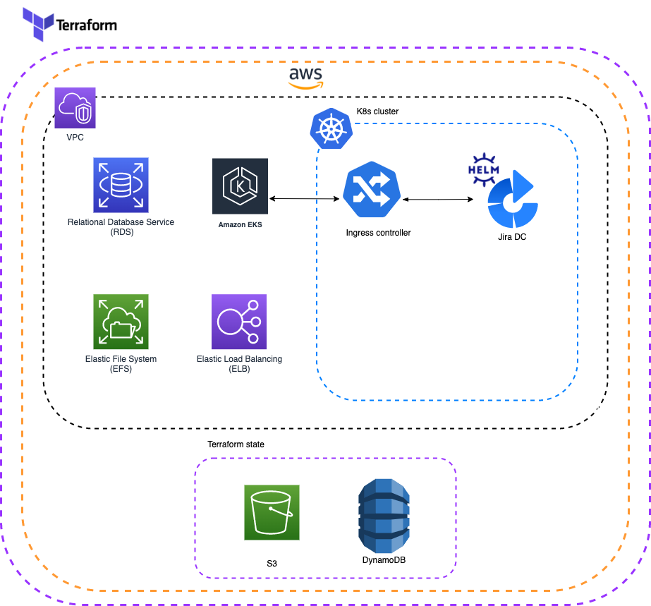
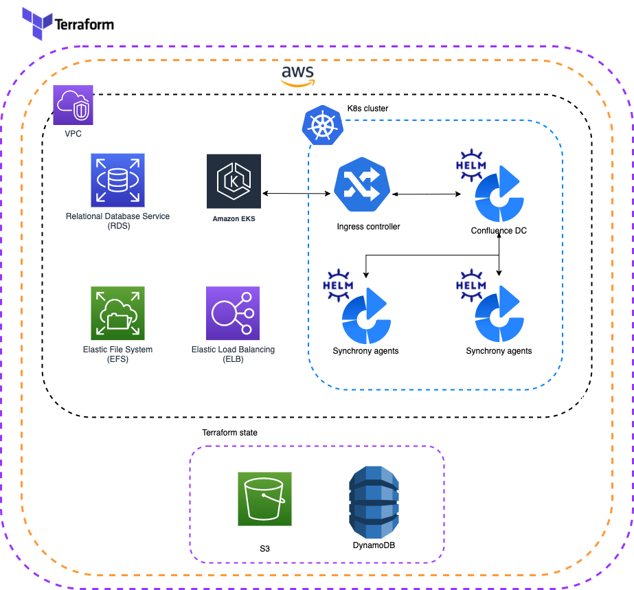
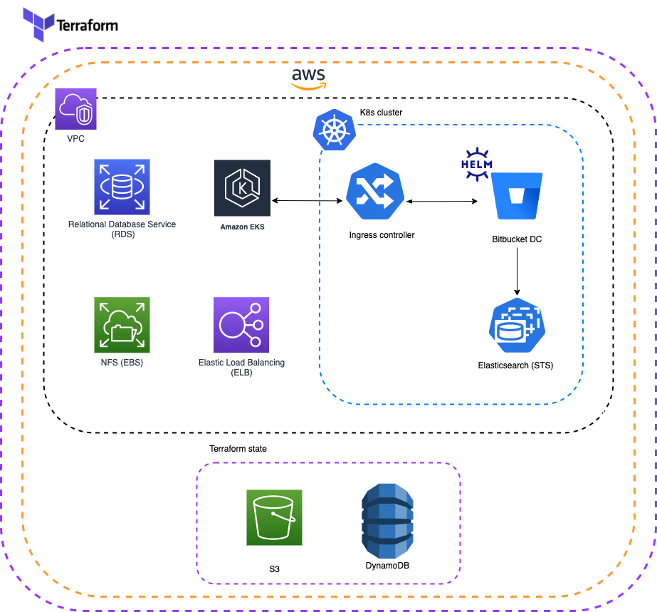
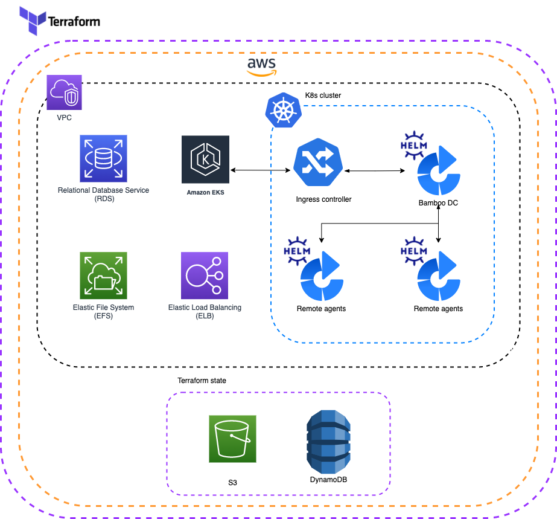

# Deployment Automation for Atlassian DC on K8s

 

## Support disclaimer

!!! warning "Official support warning"
    **This project is designed for Atlassian vendors to run [DC App Performance Toolkit](https://developer.atlassian.com/platform/marketplace/dc-apps-performance-and-scale-testing/){.external} and is not officially supported.**

    We don't recommend using the scripts to deploy production instances but they can be used for inspiration and to deploy testing stacks.
    Beware that the project is tested only for DCAPT framework use case with the pre-defined configuration files only.

## Products and Platforms

!!! info "Available Products and Platforms"
    
    The following products can be installed to [Amazon Web Services](https://aws.amazon.com/){.external}:

    * [Jira](https://confluence.atlassian.com/jirasoftware/jira-software-8-19-x-release-notes-1082526044.html){.external}
    * [Jira Service Management](https://confluence.atlassian.com/servicemanagement/jira-service-management-4-20-x-release-notes-1085202556.html){.external}
    * [Confluence](https://confluence.atlassian.com/doc/confluence-7-13-release-notes-1044114085.html){.external}
    * [Bitbucket](https://confluence.atlassian.com/bitbucketserver/bitbucket-data-center-and-server-7-17-release-notes-1086401305.html){.external}
    * [Bamboo](https://confluence.atlassian.com/bamboo/bamboo-8-1-release-notes-1103070461.html){.external}

This project can be used for bootstrapping Atlassian DC products in a Kubernetes cluster. This tool will create a Kubernetes cluster and all the required infrastructure. It will also install Atlassian DC products into this pre-provisioned cluster using the [Data Center Helm Charts](https://atlassian.github.io/data-center-helm-charts/){.external}.

## Deployment overview

The diagram below provides a high level overview of what a typical deployment will look like for each DC product:

=== "Jira"

    !!! info "Architectural overview for Jira"

    

=== "Confluence"

    !!! info "Architectural overview for Confluence"

    

=== "Bitbucket"

    !!! info "Architectural overview for Bitbucket"

    

=== "Bamboo"

    !!! info "Architectural overview for Bamboo"

    

!!! tip "Cluster size and cost"

    [Cluster Autoscaler](https://github.com/kubernetes/autoscaler/tree/master/cluster-autoscaler) is provisioned as part of the deployment.

    You can define the minimum and maximum size of the cluster. The number of nodes will be automatically adjusted 
    depending on the workload resource requirements.

!!! tip "Multiple deployments to a single cluster"

    Multiple DC products can also be provisioned to the same cluster. See the [Configuration guide](./userguide/configuration/CONFIGURATION.md#products) for more details

## Deploying a Data Center product

* [Prerequisites](userguide/PREREQUISITES.md) - steps for environment setup including installation of 3rd party tooling
* [Configuration](userguide/configuration/CONFIGURATION.md) - steps for configuring deployment
* [Installation](userguide/INSTALLATION.md) - steps for running a deployment

## Product support

The minimum versions that we support for each product are:

| Jira DC                                                                                                             | Jira Service Management DC                                                                                                         | Confluence DC                                                                                         | Bitbucket DC                                                                                                                            | Bamboo DC                                                                                          |
|---------------------------------------------------------------------------------------------------------------------|------------------------------------------------------------------------------------------------------------------------------------|-------------------------------------------------------------------------------------------------------|-----------------------------------------------------------------------------------------------------------------------------------------|----------------------------------------------------------------------------------------------------|
| [8.19](https://confluence.atlassian.com/jirasoftware/jira-software-8-19-x-release-notes-1082526044.html){.external} | [4.20](https://confluence.atlassian.com/servicemanagement/jira-service-management-4-20-x-release-notes-1085202556.html){.external} | [7.13](https://confluence.atlassian.com/doc/confluence-7-13-release-notes-1044114085.html){.external} | [8.17](https://confluence.atlassian.com/bitbucketserver/bitbucket-data-center-and-server-7-17-release-notes-1086401305.html){.external} | [8.1](https://confluence.atlassian.com/bamboo/bamboo-8-1-release-notes-1103070461.html){.external} |  

## Feedback

If you find any issues, [raise a ticket](https://github.com/atlassian-labs/data-center-terraform/issues){.external}. In case of technical questions, issues or problems using this project with DC App Performance Toolkit, contact us for help in the community Slack [#data-center-app-performance-toolkit](http://bit.ly/dcapt_slack){.external} channel.

## Contributions

Contributions are welcome! [Find out how to contribute](https://github.com/atlassian-labs/data-center-terraform/blob/main/CONTRIBUTING.md). 

## License

Apache 2.0 licensed, see [license file](https://github.com/atlassian-labs/data-center-terraform/blob/main/LICENSE){.external}.
