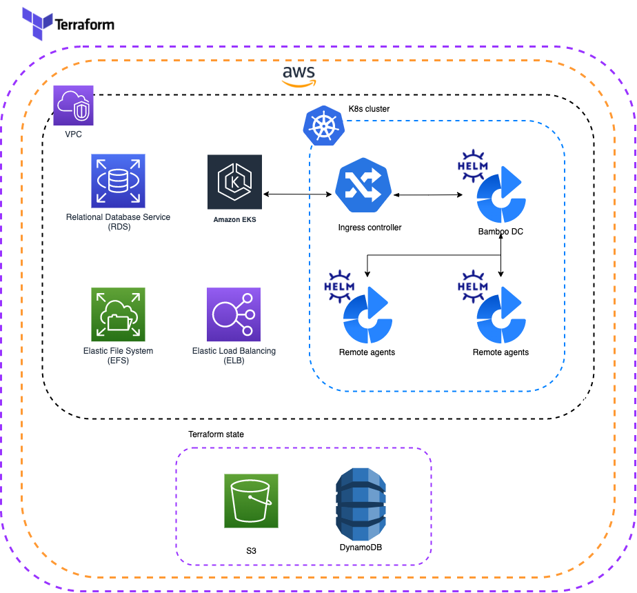

# Infrastructure for Atlassian Data Center products on Kubernetes

 

## Support disclaimer

!!! warning "Supported Products and Platforms"
    **This project is still under development and is not officially supported.**

    Current project limitations listed below:

    * [AWS](https://aws.amazon.com/){.external} is the only supported cloud provider.
    * [Bamboo DC](https://confluence.atlassian.com/bamboo/bamboo-8-1-release-notes-1103070461.html){.external} is the only DC product supported by this project.

    Support for additional Cloud providers and DC products will be made available in future.
    
This project can be used for bootstrapping Atlassian Bamboo DC in a K8s cluster. Soup to nut's, this tool will stand-up a Kubernetes cluster and all the required infrastructure needed for running Bamboo DC. Using the existing [Data Center Helm Charts](https://atlassian.github.io/data-center-helm-charts/#additional-content){.external} it will also install Bamboo DC into this pre-provisioned cluster.

## Deployment overview

The diagram below provides a high level overview of what a typical deployment will look like:

## Deploying a Data Center product

* [Prerequisites](userguide/PREREQUISITES.md) - steps for environment setup including installation of 3rd party tooling
* [Configuration](userguide/CONFIGURATION.md) - steps for configuring deployment
* [Installation](userguide/INSTALLATION.md) - steps for running a deployment

## Product support

Atlassian Data Center products that can be provisioned with this tool:

|  Bamboo DC                                                                                         |
|----------------------------------------------------------------------------------------------------|
| [8.1](https://confluence.atlassian.com/bamboo/bamboo-8-1-release-notes-1103070461.html){.external}  |

## Feedback

If you find any issues, [raise a ticket](https://github.com/atlassian-labs/data-center-terraform/issues){.external}. If you have general feedback or question regarding the project, use [Atlassian Community Kubernetes space](https://community.atlassian.com/t5/Atlassian-Data-Center-on/gh-p/DC_Kubernetes){.external}.

## Contributions

Contributions are welcome! [Find out how to contribute](https://github.com/atlassian-labs/data-center-terraform/blob/main/CONTRIBUTING.md). 

## License

Apache 2.0 licensed, see [license file](https://github.com/atlassian-labs/data-center-terraform/blob/main/LICENSE){.external}.