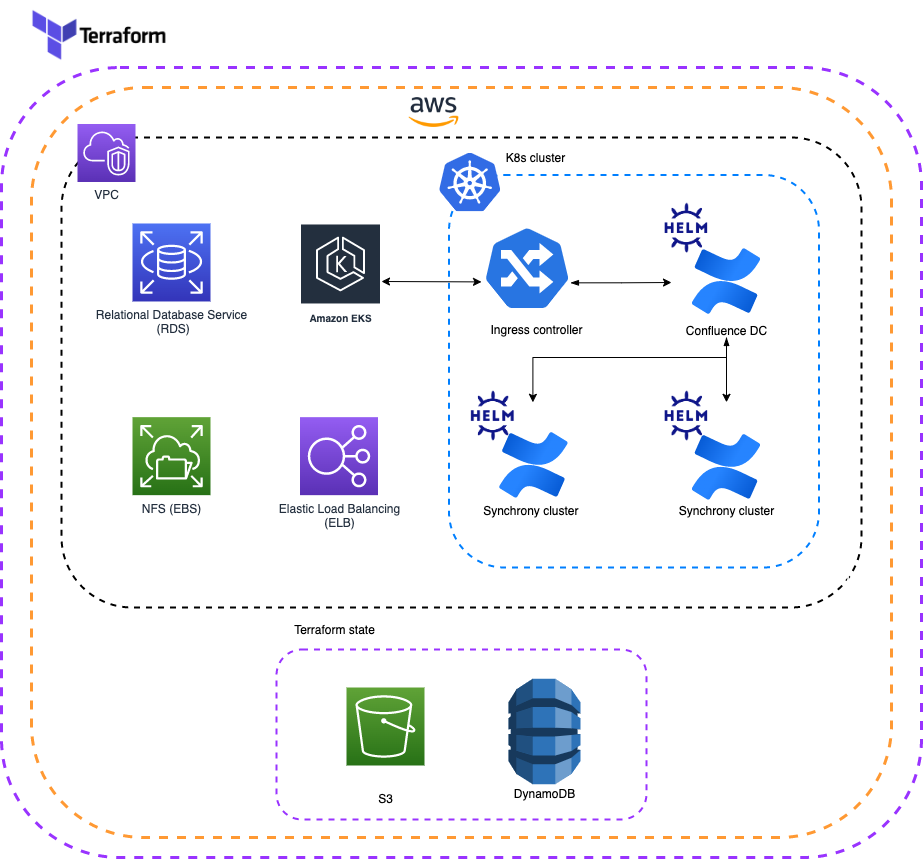
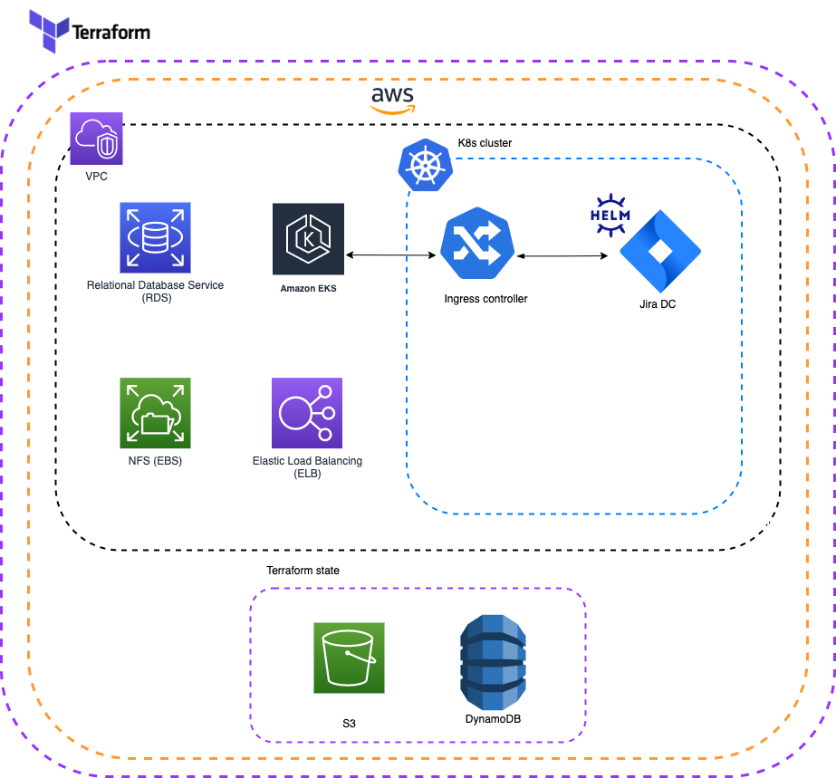

# Deployment Automation for Atlassian DC on K8s

 

## Support disclaimer

!!! warning "Supported Products and Platforms"
    **This project is designed for Atlassian vendors to run DCAPT performance toolkit and is not officially supported.**

    Current project limitations listed below:

    * [AWS](https://aws.amazon.com/){.external} is the only supported cloud provider.
    * [Bamboo](https://confluence.atlassian.com/bamboo/bamboo-8-1-release-notes-1103070461.html){.external}, [Confluence](https://confluence.atlassian.com/doc/confluence-7-13-release-notes-1044114085.html){.external}, and [Jira](https://confluence.atlassian.com/jirasoftware/jira-software-8-19-x-release-notes-1082526044.html){.external} are the DC products supported by this project.

    Support for additional DC products will be made available in future.
    
This project can be used for bootstrapping Atlassian DC products in a K8s cluster. This tool will stand-up a Kubernetes cluster and all the required infrastructure. It will also install supported Atlassian DC products into this pre-provisioned cluster using the [Data Center Helm Charts](https://atlassian.github.io/data-center-helm-charts/#additional-content){.external}.

## Deployment overview

The diagram below provides a high level overview of what a typical deployment will look like for each DC product:

=== "Bamboo"

    !!! info "Architectural overview for Bamboo"

    

=== "Confluence"

    !!! info "Architectural overview for Confluence"

    

=== "Jira"

    !!! info "Architectural overview for Jira"

    

!!! tip "Multiple deployments to a single cluster"

    Multiple DC products can also be provisioned to the same cluster. See the [Configuration guide](./userguide/CONFIGURATION.md#products) for more details

## Deploying a Data Center product

* [Prerequisites](userguide/PREREQUISITES.md) - steps for environment setup including installation of 3rd party tooling
* [Configuration](userguide/configuration/CONFIGURATION.md) - steps for configuring deployment
* [Installation](userguide/INSTALLATION.md) - steps for running a deployment

## Product support

The minimum versions that we support for each product are:

|  Bamboo DC                                                                                         | Confluence DC                                                                                          | Jira DC                                                                                                                  |
|----------------------------------------------------------------------------------------------------|--------------------------------------------------------------------------------------------------------|--------------------------------------------------------------------------------------------------------------------------|
| [8.1](https://confluence.atlassian.com/bamboo/bamboo-8-1-release-notes-1103070461.html){.external} | [7.13](https://confluence.atlassian.com/doc/confluence-7-13-release-notes-1044114085.html){.external}  | [8.19](https://confluence.atlassian.com/jirasoftware/jira-software-8-19-x-release-notes-1082526044.html){.external}      |  

## Feedback

If you find any issues, [raise a ticket](https://github.com/atlassian-labs/data-center-terraform/issues){.external}. If you have general feedback or question regarding the project, use [Atlassian Community Kubernetes space](https://community.atlassian.com/t5/Atlassian-Data-Center-on/gh-p/DC_Kubernetes){.external}.

## Contributions

Contributions are welcome! [Find out how to contribute](https://github.com/atlassian-labs/data-center-terraform/blob/main/CONTRIBUTING.md). 

## License

Apache 2.0 licensed, see [license file](https://github.com/atlassian-labs/data-center-terraform/blob/main/LICENSE){.external}.

